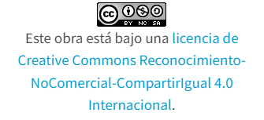

# Explicacion Pagina Web
## Contenido

- [0- Explicacion](contenidos/explicacion.md)
- [1- Pagina web](https://hugogonzalezsalas.github.io/paginaweb/)

## Referencias

- [Video de Jesus](https://access.redhat.com/documentation/es-es/red_hat_enterprise_linux/8/html/configuring_basic_system_settings/index)

## Autor

- [Hugo Gonzalez Salas](https://github.com/HugoGonzalezSalas)

## Licencia

